# Hands on regular expressions
### 1. Display a list of all the users on your system who log in with the Bash shell as a default.

```bash
awk -F':' '$NF == "/bin/bash" {print $1}' /etc/passwd 
```
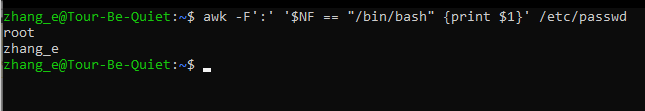
### 2. From the /etc/group directory, display all lines starting with the string "daemon".

```bash
grep "^daemon" /etc/group
```
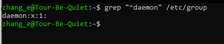

### 3. Print all the lines from the same file that don't contain the string.

```bash
grep -v "daemon" /etc/group
```
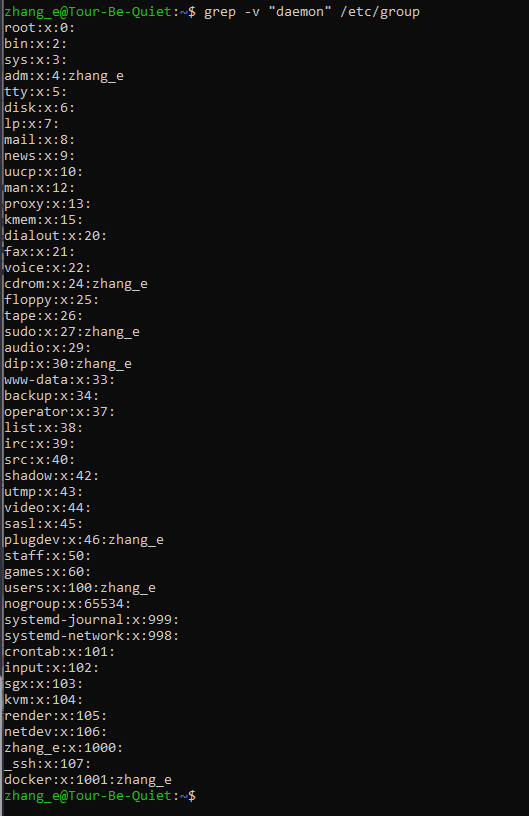

### 4. Display localhost information from the /etc/hosts file, display the line number(s) matching the search string and count the number of occurrences of the string.

```bash
grep -n "localhost" /etc/hosts
```
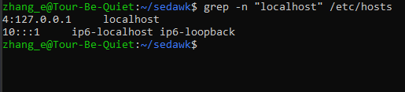

### 5. Display a list of /usr/share/doc subdirectories containing information about shells.

```bash
find /usr/share/doc -type d -name "*shell*"
```
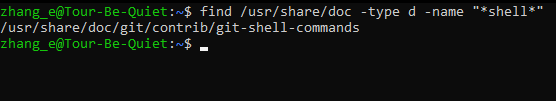

### 6. How many README files do these subdirectories contain? Don't count anything in the form of "README.a_string".

```bash
find /usr/share/doc -type d -name "*shell*" -exec find {} -type f -name "README" \; | grep -v "README.a_string" | wc -l
```
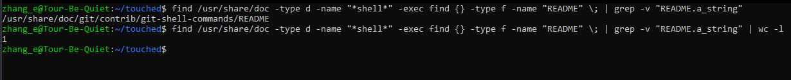

### 7. Make a list of files in your home directory that were changed less that 10 hours ago, using grep, but leave out directories.

```bash
find ~/ -maxdepth 1 -type f -mmin -600 -exec ls -l {} \; | grep -v "/$"
```
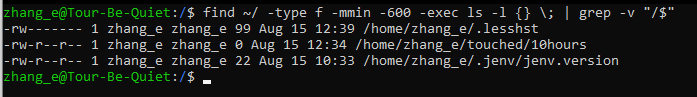

### 8. Can you find an alternative for wc -l, using grep?

```bash
grep -c ""
```
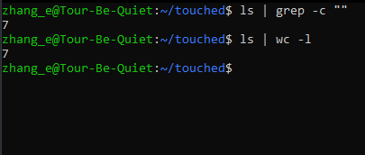

### 9. Using the file system table (/etc/fstab for instance), list local disk devices.

```bash
grep -v '^#' /etc/fstab | awk '{print $1}'
```
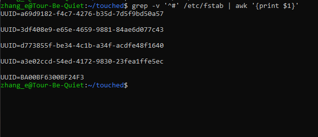

### 10. Display configuration files in /etc that contain numbers in their names.

```bash
find /etc -type f -name '*[0-9]*'
```

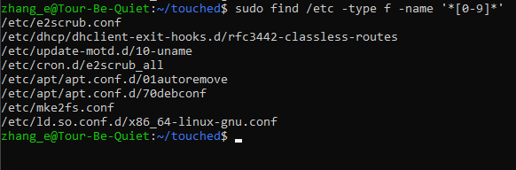


### 11. At least two games from Regex Crossword 

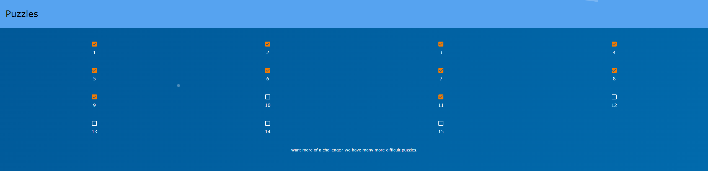