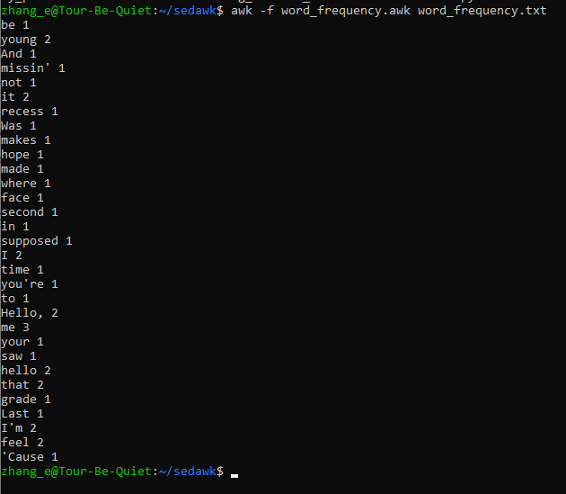
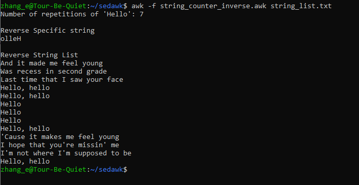
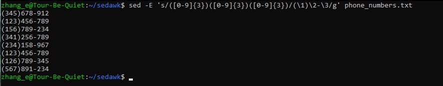
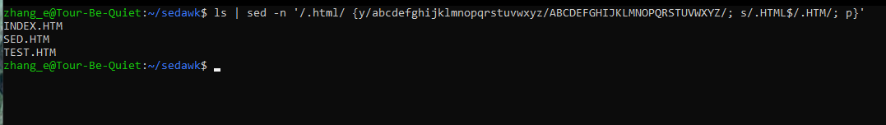
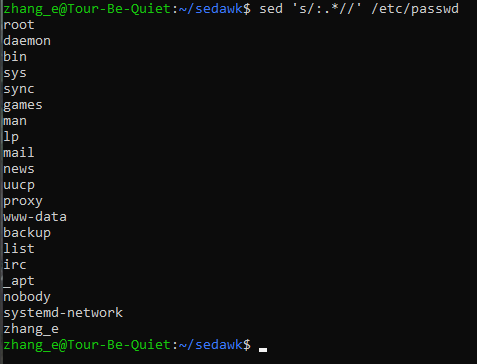

# Hands on Awk & Sed / POSIX
### 1. Give the AWK script that displays the word frequency of a text.

```bash
awk -f word_frequency.awk word_frequency.txt
```



### 2. Create an AWK script that show the number of repetition of a specific string in a list of strings then inverse it.

```bash
awk -f string_counter_inverse.awk string_list.txt
```



### 3. Given a list of telephone numbers of the form 123456789 use sed to rewrite them as (123)456-789.

```bash
sed -E 's/([0-9]{3})([0-9]{3})([0-9]{3})/(\1)\2-\3/g' phone_numbers.txt  
```


### 4. Use sed to select and convert all file names with suffix .html given as output by ls into capital letters with suffix .HTM. Check out command y in sed man page

```bash
ls | sed -n '/.html$/ {y/abcdefghijklmnopqrstuvwxyz/ABCDEFGHIJKLMNOPQRSTUVWXYZ/; s/.HTML$/.HTM/; p}'
```


### 5. Use sed to extract full user names from /etc/passwdcl

```bash
sed 's/:.*//' /etc/passwd 
```
