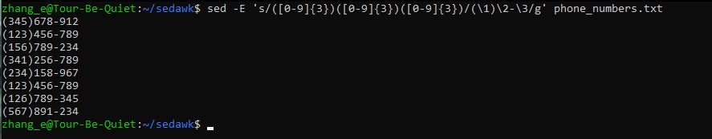
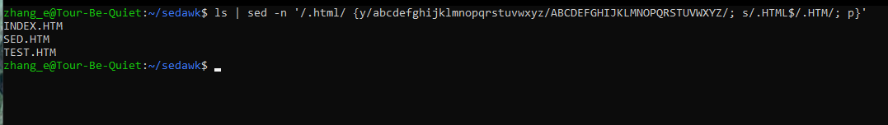
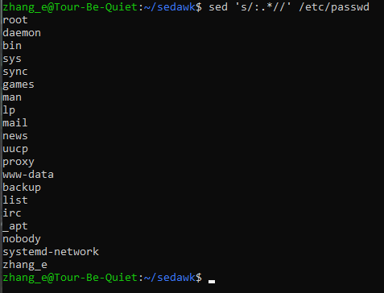

# Hands on Awk & Sed / POSIX
### 1. Given a list of telephone numbers of the form 123456789 use sed to rewrite them as (123)456-789.

```bash
sed -E 's/([0-9]{3})([0-9]{3})([0-9]{3})/(\1)\2-\3/g' phone_numbers.txt  
```


### 2. Use sed to select and convert all file names with suffix .html given as output by ls into capital letters with suffix .HTM. Check out command y in sed man page

```bash
ls | sed -n '/.html$/ {y/abcdefghijklmnopqrstuvwxyz/ABCDEFGHIJKLMNOPQRSTUVWXYZ/; s/.HTML$/.HTM/; p}'
```


### 3. Use sed to extract full user names from /etc/passwdcl

```bash
sed 's/:.*//' /etc/passwd 
```
