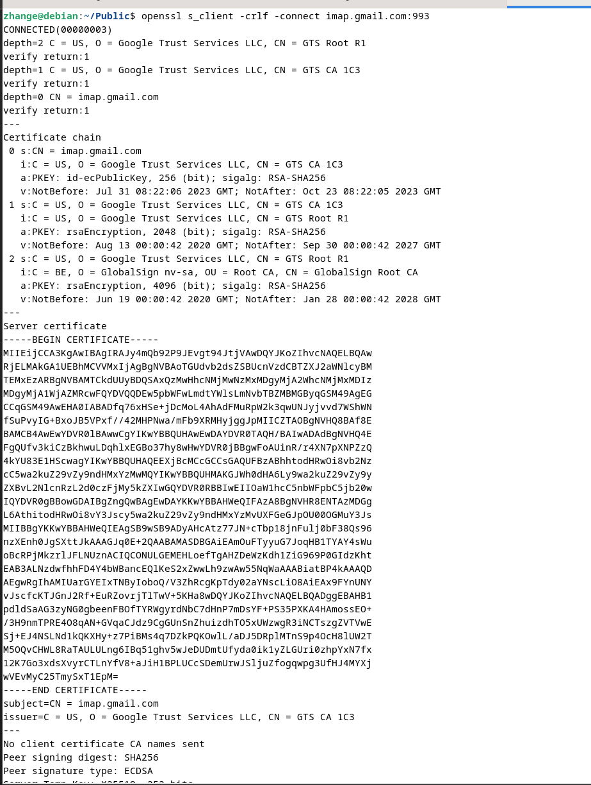
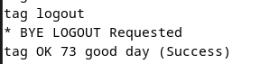

# Web protocols
## IMAP :

An IMAP or Internet Message Access Protocol, is a standard email retrieval protocol. It stores email messages on a mail server and enables the user to view and manipulate them as though they were stored locally on their device(s).

### 1. Connect
The first step of the exercise is to use openssl to connect to a imap server using the following command

```bash
openssl s_client -crlf -connect imap.gmail.com:993
```

```openssl``` is a command from the OpenSSL Library, it allows you to perform various SSL/TLS-related operations, such as connecting to secure servers, generating certificates, and more.

```s_client``` act as an SSL client

```-crlf``` this option translated a line feed from the terminal into CR+LF ("\r + \n") as required by some servers.

```-connect imap.gmail.com:993``` specifies the server and port to which the client should establish a secure connection



### 2. Login
Next step is to login, by issuing the following command

```bash
tag login user@gmail.com password
```

```tag``` is some character sequence required to be used before each IMAP command.

```login``` is the command to login

```user@gmail.com password``` your email address followed by your password


### 3. List Mailboxes
By issuing the following command

```bash
tag LIST "" "*"
```

We can list all the mailboxes


### 4. Mailbox Status
We can check a mailboxe status
```
tag STATUS INBOX (MESSAGES)
```
It show the number of emails in the mailboxe 


### 5. Select a mailbox
The SELECT command is one of the fundamental commands in the IMAP  that is used to interact with an email server. It allows a client to select a mailbox on the server for further operations.

```
tag SELECT <MailboxName>
```


### 6. Fetch
Now that a mailbox is selected, we can fetch email in that mailbox

<b>Multiple Fetch</b>
```
tag FETCH FROM:TO (BODY)
```
eg. for the last 10 of 2033 Messages (mail)
```
tag FETCH 2023:2033 (BODY)
```


The response will be the MIME structure of the message bodies, which may include plain text, HTML, and any attachments.

<b>To get the content of the email</b>

```
tag FETCH <Number> (BODY[1])
```


### 7. Log out
Close the IMAP session
```bash
tag LOGOUT
```



## HTTP:

### 1. Send an HTTP request to a web server using telnet.

```bash
telnet localhost 80
```

```bash
GET / HTTP/1.1
Host: localhost
```


### 2. Intercept an HTTP request coming to your browser using netcat

```
nc -l -p 8081
```

You need to configure your browser to use a proxy server with the address "127.0.0.1 and the port that you set on the netcat "8081"


### 3. Explain the difference between HTTP1 & HTTP2

HTTP/1 and HTTP/2 are both versions of the Hypertext Transfer Protocol used for transferring data over the web.

They serve the same fundamental purpose but there are significant differences between the two versions that impact performance, efficiency, and user experience.

<b>Multiplexing</b>:  
In HTTP/1, multiple resources (e.g., images, scripts, stylesheets) are requested and fetched over separate connections. This leads to inefficiencies and delays, known as the "head-of-line blocking" problem.  
HTTP/2 introduces multiplexing, where multiple resources can be requested and fetched over a single connection simultaneously. This eliminates the head-of-line blocking issue and improves overall page load times.

<b>Header Compression</b>:  
In HTTP/1, headers are sent with each request and response, leading to high overhead for large or frequent requests.  
HTTP/2 uses HPACK header compression, which significantly reduces the overhead of headers by encoding and sending them only once.

<b>Server Push</b>:  
HTTP/1 doesn't support server push. Browsers have to explicitly request all resources.  
HTTP/2 introduces server push, allowing the server to proactively send resources to the client's cache before they're explicitly requested, reducing the number of round trips.  
eg. `link` header in html

<b>Stream Prioritization</b>:   
HTTP/2 allows servers to specify the priority of resources, ensuring that more critical resources are fetched first, improving page rendering.

<b>Binary Protocol</b>:  
HTTP/1 uses a textual protocol, which requires parsing and interpretation by both the client and the server.  
HTTP/2 uses a binary protocol, making parsing faster and reducing processing overhead.

<b>Backward Compatibility</b>:  
HTTP/2 maintains backward compatibility with HTTP/1, so older clients and servers can still communicate over HTTP/2-supporting infrastructure.

<b>Security</b>:  
While both HTTP/1 and HTTP/2 can be used over HTTPS for secure communication, the default for HTTP/1 is plaintext HTTP.  
In HTTP/2, HTTPS is strongly encouraged, improving security and privacy for users.

HTTP/2's improvements are designed to enhance performance and efficiency, particularly for modern web applications that use a large number of resources. It addresses many of the limitations and inefficiencies of HTTP/1, resulting in faster page load times and better user experiences.

<b>BONUS HTTP/3</b>  
HTTP/3 is also designed to improve web performance by addressing the limitations of HTTP/1. HTTP/2 introduces multiplexing, header compression, and other optimizations, while HTTP/3 goes further by using the QUIC transport protocol to reduce latency and improve reliability.