# Kubernetes Foundations

## 1. Install Kubernetes modules
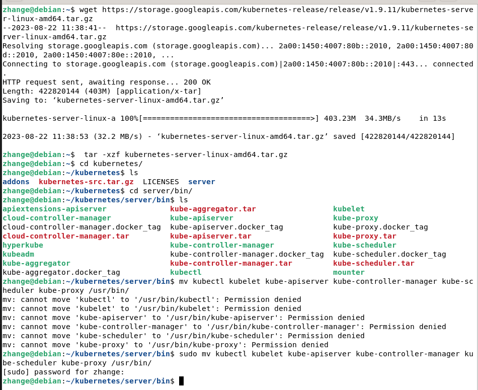
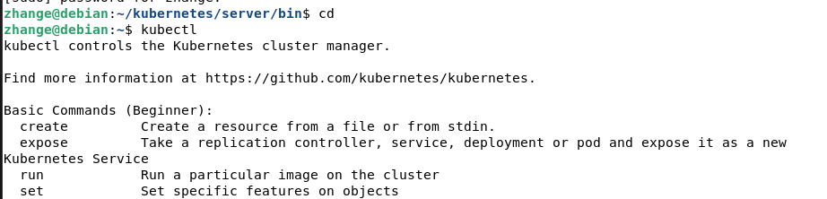

## 2. Setup kubelet and log file + adding test pod
Node component that talk to the container runtime to tell when and what to run

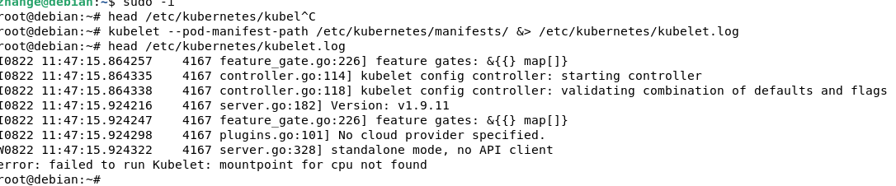

## 3. Install etcd

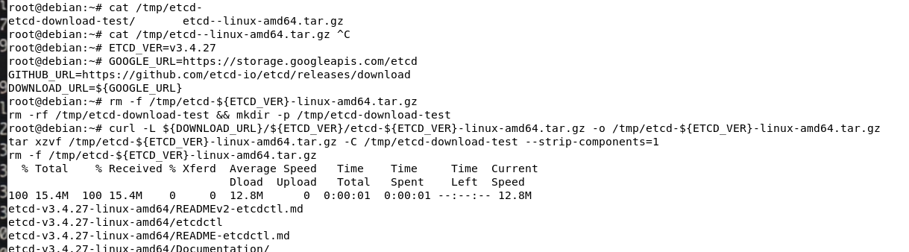
https://github.com/etcd-io/etcd/releases/

## 4. Setup etcd
store state

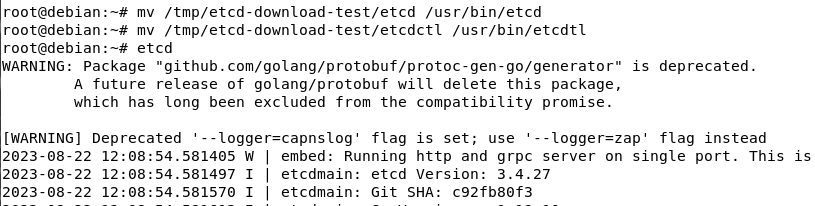
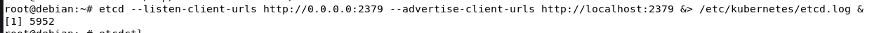
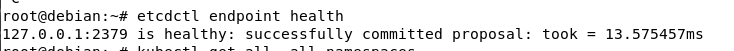

## 5. Setup Kube-apiserver + log file
Server for kubernetes api
Access to ressources, Coordonates, Authorization, Authentification, Admissions, Metrix, Reports

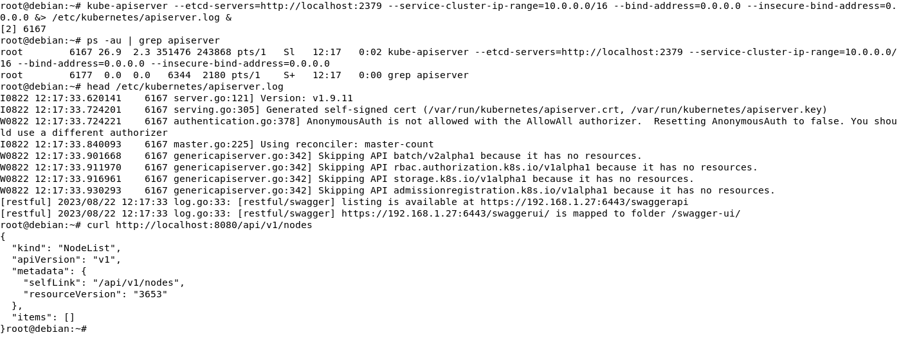

## 6. Connect Kubelet to kube apiserver with kubectl

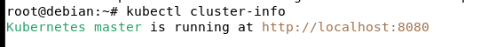

### 6.1 Setup kubectl config
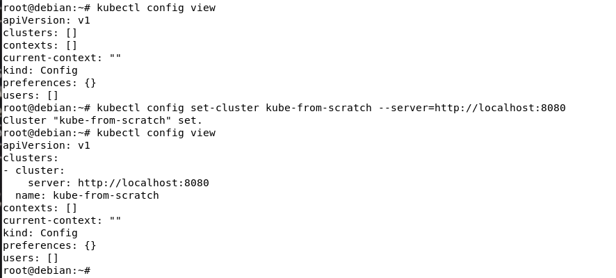
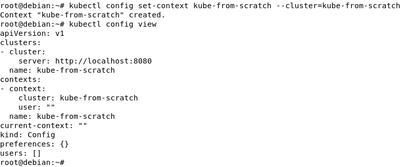
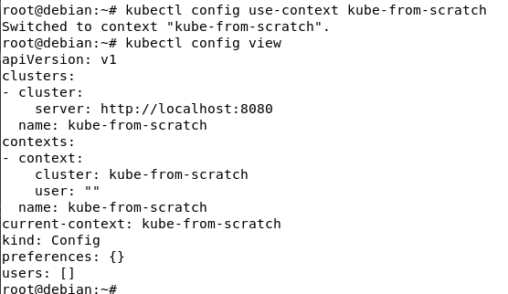

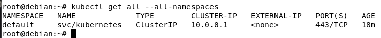

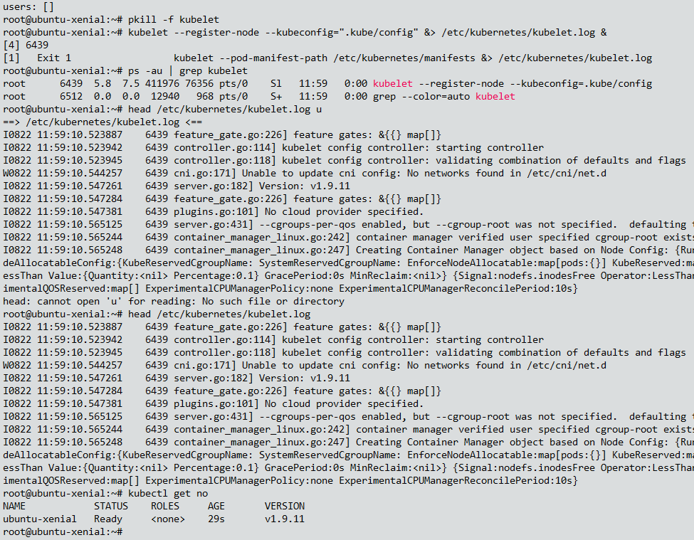

## 7. Create POD

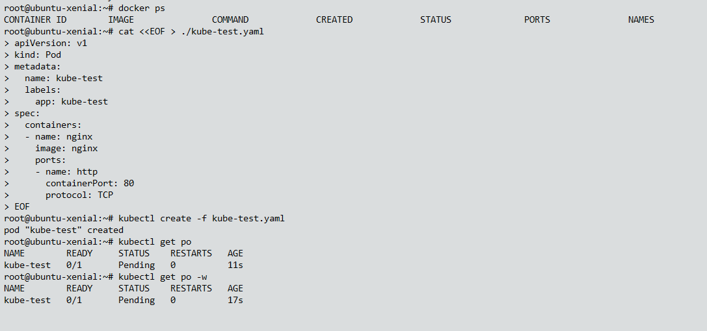

## 8. Setup Kube-Scheduler and log file
Tell the pods which node to go
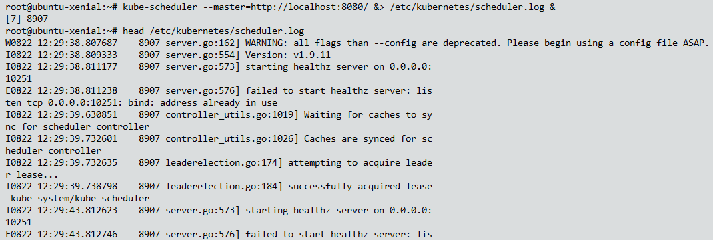

## 9. Create deployment pods manifest

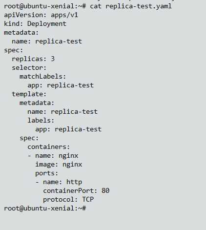

## 10. Setup Kube-Controller-manager and log file
Controllers make sure that pods are running

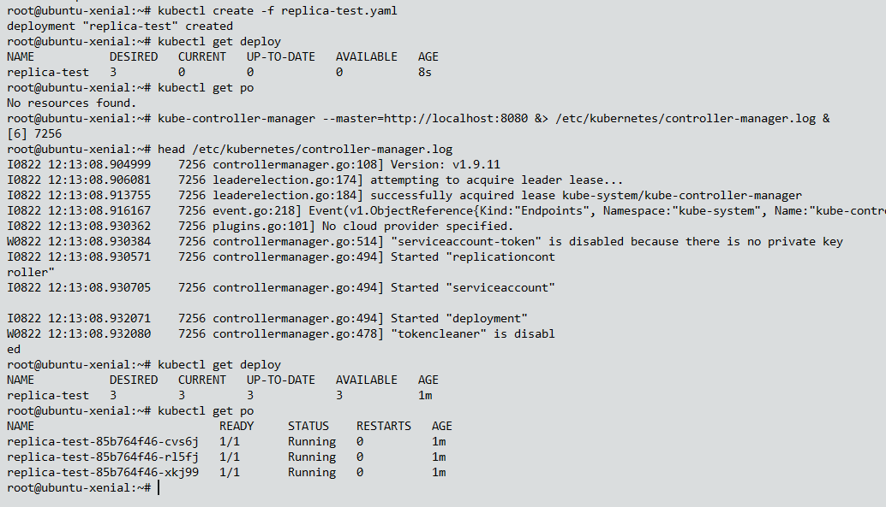

## 9. Create Service manifest

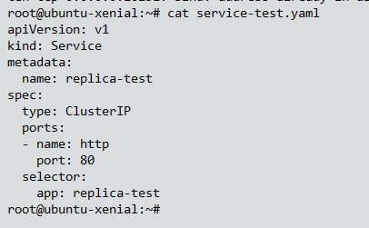

## 11. Kube proxy
In charge of networking, setting up networking rules on the nodes allowing the pods to communicate

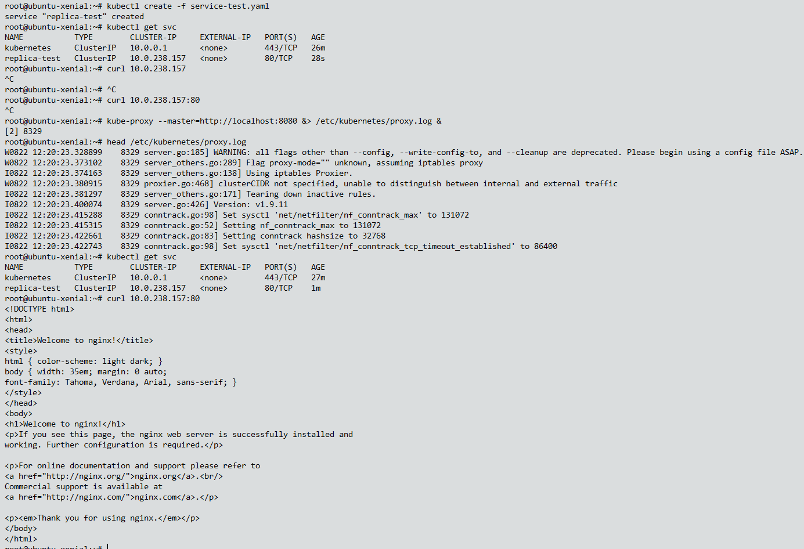

As you can see the 1st curl wasn't working and after setting up the kube-proxy we could curl our nginx pod