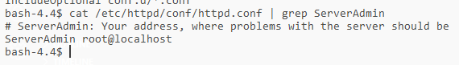

# Kubectl 

## 1. Guided Exercise: Contrasting Kubernetes Distributions

## 2. Guided Exercise: Connecting kubectl to Your Cluster

### 2.1 Installing kubectl in Windows

### 2.2 Download the DO100-apps repository

### 2.3 Connecting kubectl to the Kubernetes cluster

## 3. Guided Exercise: Running and Interacting with Your First Application

### 3.1 Set namespace

### 3.2 Create a new pod webserver

### 3.4 Create a new pod resource

Apply the change

Verify that the label has been updated

### 3.5 Finish - Delete the pods

## 4. Guided Exercise: Deploying Managed Applications

### 4.1 Create a Deployment

### 4.2 Increasy availability by creating replica

### 4.3 Terminate one of the pods

### 4.4 Edit deployment pod

### 4.5 Finish - Delete

Automaticly terminate the running pods after delete
