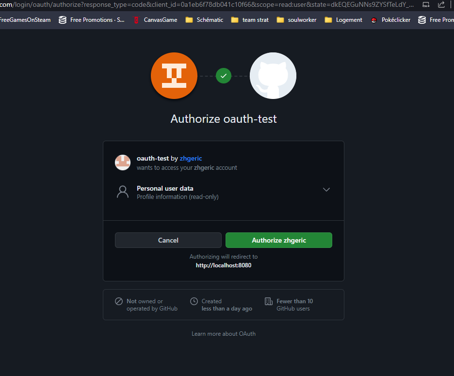

# Explain with an example, how Oauth works (Request by Request) : 

OAuth (Open Authorization) is a protocol that allows a user to grant a third-party application limited access to their resources without sharing their credentials (like a password). OAuth involves several actors, including the user, the resource owner, the client application, the authorization server, and the resource server.

<b>User: </b>
The user is the person who owns the data or resources that a client application wants to access. For example, the user might own their social media profile data on a platform like Facebook.

<b>Client Application:</b>
The client application is a third-party application that wants to access the user's resources, such as a mobile app or a website. For example, consider a weather app that wants to post weather updates to the user's Facebook wall.

<b>Resource Owner:</b>
The resource owner is the user who has control over the resources. In this case, it's the user who owns the Facebook profile.

<b>Authorization Server:</b>
The authorization server is responsible for authenticating the user and issuing access tokens to the client application. In the Facebook example, Facebook's authorization server plays this role.

<b>Resource Server:</b>
The resource server hosts the protected resources, like the user's Facebook profile. It checks the validity of access tokens and serves the requested data if the token is valid.

Here's a step-by-step explanation of how OAuth works with an example:

# Step 1: Authorization Request

Actor: Client Application  
Purpose: The client application redirects the user to the authorization server to request permission to access the user's resources.  
HTTP Request: Redirect to the authorization server's authorization endpoint with parameters like client ID, requested scope, and a redirect URI.  

# Step 2: User Authorization

Actor: User  
Purpose: The user logs in or authenticates with the authorization server and decides whether to grant or deny the client application's request.  
HTTP Request: The user interacts with the authorization server to grant access permissions.

# Step 3: Authorization Grant

Actor: Authorization Server  
Purpose: If the user grants permission, the authorization server issues an authorization code or an access token to the client application.  
HTTP Response: The authorization server responds to the client's redirect URI with the authorization code or access token.

# Step 4: Token Request

Actor: Client Application  
Purpose: The client application, with the obtained authorization code, requests an access token from the authorization server.  
HTTP Request: The client application sends a POST request to the authorization server's token endpoint with the authorization code, client ID, client secret (if applicable), and the redirect URI.

# Step 5: Access Token Issuance

Actor: Authorization Server  
Purpose: The authorization server validates the authorization code and issues an access token to the client application.  
HTTP Response: The authorization server responds with an access token.

# Step 6: Accessing Protected Resource

Actor: Client Application  
Purpose: The client application accesses the protected resource (e.g., the user's Facebook profile) by presenting the access token to the resource server.  
HTTP Request: The client includes the access token in the request to the resource server's API.

# Step 7: Resource Server Response

Actor: Resource Server  
Purpose: The resource server verifies the access token's validity and serves the requested resource if the token is valid.  
HTTP Response: The resource server responds with the requested data (e.g., the user's Facebook profile information).

In this way, OAuth allows the client application to access the user's resources without exposing the user's credentials to the application. It provides a secure and standardized way to grant limited access to third-party applications.

# Explore the design solutions possible to implement OAuth from a Resource provider perspective

# What is OIDC : In detail? 

OpenID Connect (OIDC)
OpenID Connect (OIDC) was designed to provide a key feature needed for an
authentication service. Even if OAuth 2.0 authorization servers were capable of
authenticating users, the framework did not provide a standard way to securely convey
the identity of an authenticated user to an application. OIDC provided a solution for
this need. OIDC was devised as a layer on top of the OAuth 2.0 protocol to provide
information in a standard format to applications about the identity of an authenticated
user.vi This provided a solution for applications for user authentication as well as API
authorization. The implementation of OIDC by widely used social media/service
providers like Google, PayPal, and Yahoo provided a solution for consumer-facing
authentication services, but there was nothing in the protocol to limit it to consumerfacing scenarios.
OIDC offers benefits to users, application developers, and identity providers. Web
site developers can delegate the work of implementing authentication and password
reset logic to an OIDC provider. Users benefit because they can leverage one account to
log in to many sites without exposing their account credentials to those other sites. Users
have fewer usernames and passwords to manage and enjoy single sign-on. Providers
may benefit if OIDC support attracts more users to their platform. OIDC provides the
web single sign-on benefits that were attractive in SAML 2.0 and, when combined with
OAuth 2.0, provides a solution with authentication as well as the API authorization
capabilities needed by modern applications.
The previous sections provided a brief history of different solutions for managing
identities and authenticating users. We’ll close with a few words on the benefits of
standard protocols.

# explain with a use case where OIDC is needed and where Oauth is not enough

The scenario OIDC is designed to solve involves a user who needs to be authenticated in order to access an application. 
OIDC enables an application to delegate user authentication to an OAuth 2.0 authorization server and have it return to the application claims about the authenticated user and authentication event in a standard format.

The OAuth 2.0v version of
the specification allows a user to authorize one application, known as a client (the photo
printing site), to send a request to an API, known as a resource server (the social media
site), on the user’s behalf to retrieve data at the resource server owned by the user.

# Create an app on github, retreive the AccessToken with postman and make a call to the API

Create an app that is protected by Github login + In a diagram explain what happenned 

Where did you code/configure that the app should forward to the exact url of Github?

On google, Create an OIDC API KEY, and get the IDToken and decode it and retreive it’s data

